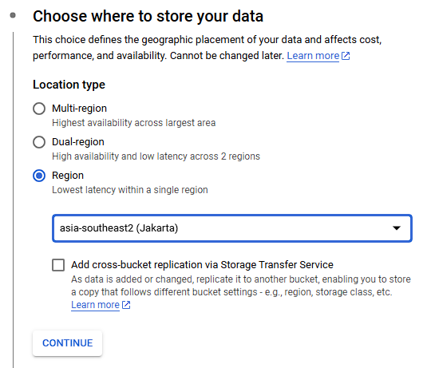
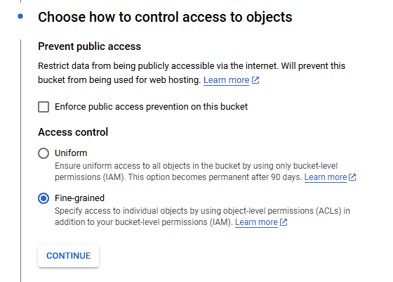
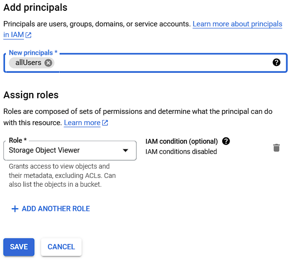
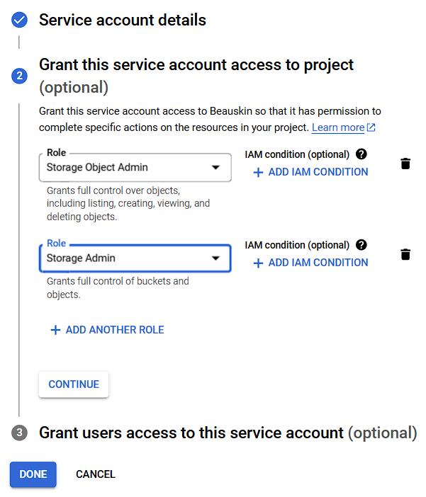

# BeauSkin Cloud Computing

BeauSkin is an AI-powered skin analysis service that provides automated assessment of skin conditions, acne detection, and skin type classification using machine learning models.

## Setup Instructions

### Clone the Project

```bash
git clone https://github.com/Bangkit-Beauskin/beauskin-cloud-computing
cd beauskin-cloud-computing
```

### Prerequisites

- Python 3.8 or higher
- pip package manager
- Virtual environment (recommended)

### GCP Settings

#### Cloud Storage

- login to your google cloud platfrom account
- search buckets and click buckets option

- click CREATE to create new buckets
- choose where to store your data to region and choose where you want store data



- choose how to control access to objects
- uncheck enforce public access and set access control to fine-grained



- click your bucket name in list of bucket
- click permissions option
- click GRANT ACCESS
- in new perincipals choose allUsers
- in role choose storage object viewer



- open file main.py change code bucket_name to your bucket name
  

#### Service Account

- search Service Accounts
- click CREATE SERVICE ACCOUNT to create new service account
- add bucket name and click CREATE AND CONTINUE
- Select a role and storage object admin and storage admin



- click CONTINUE and DONE
- in right side actions button click manage keys
- click ADD KEY and create new key
- select type json and create
- you will downloaded the service account key

### Installation

1. Create and activate virtual environment:

```bash
python3 -m venv venv
source venv/bin/activate  # For Linux/Mac
# OR
.\venv\Scripts\activate  # For Windows
```

2. Install required dependencies:

```bash
pip install fastapi uvicorn python-multipart aiofiles tensorflow pillow ultralytics opencv-python-headless numpy tensorflow-cpu scikit-learn google-cloud-storage
```

3. Save Path of Service Account Key to Environment Variable

```bash
export GOOGLE_APPLICATION_CREDENTIALS="your-credential-file"
```

### Project Structure

```
beauskin-cloud-computing/
├── main.py              # FastAPI application
├── model.py            # ML model implementations
├── models/             # Directory for ML model files
│   ├── acne_grade_model.h5
│   ├── skintypes_detection_model.h5
│   ├── best_model.pt
│   ├── skin_treatment.json
│   └── chatbot_model.h5
├── uploads/            # Directory for uploaded images
└── requirements.txt    # Project dependencies
```

### Running the Project

1. Make sure your virtual environment is activated
2. Make sure your service account key path is correct
3. Start the FastAPI server:

```bash
python main.py
```

3. Access the API:

   - API Documentation: `http://localhost:8000/docs`
   - Alternative Documentation: `http://localhost:8000/redoc`
   - Base URL: `http://localhost:8000`

4. To deactivate the virtual environment when you're done:

```bash
deactivate
```

## API Endpoints

### 1. Multi-Image Analysis (`/analyze`)

- Accepts front, left, and right face images
- Analyzes skin condition, type, and acne detection
- Returns original and annotated images with analysis results

### 2. Chatbot (`/chat`)

- Provides skin care advice and recommendations
- Returns contextual responses based on user queries

## Development

For development purposes, the `--reload` flag enables hot reloading, which automatically updates the server when code changes are detected.

## Contributing

1. Fork the repository
2. Create your feature branch (`git checkout -b feature/AmazingFeature`)
3. Commit your changes (`git commit -m 'Add some AmazingFeature'`)
4. Push to the branch (`git push origin feature/AmazingFeature`)
5. Open a Pull Request

## Models Required

Before running the project, ensure you have the following model files in the `models` directory:

- `acne_grade_model.h5`
- `skintypes_detection_model.h5`
- `best_model.pt`
- `chatbot_model.h5`
- `skin_treatment.json`

## Troubleshooting

If you encounter any issues:

1. Ensure all required models are present in the `models` directory
2. Verify that the virtual environment is activated
3. Check if all dependencies are installed correctly
4. Ensure the required ports are not in use
5. Check the uploads directory has proper write permissions
6. Verify that the Cloud Storage Admin permission has been added to the service account.
7. Ensure that the service account key path is correct.

For any additional issues, please open an issue in the GitHub repository.
